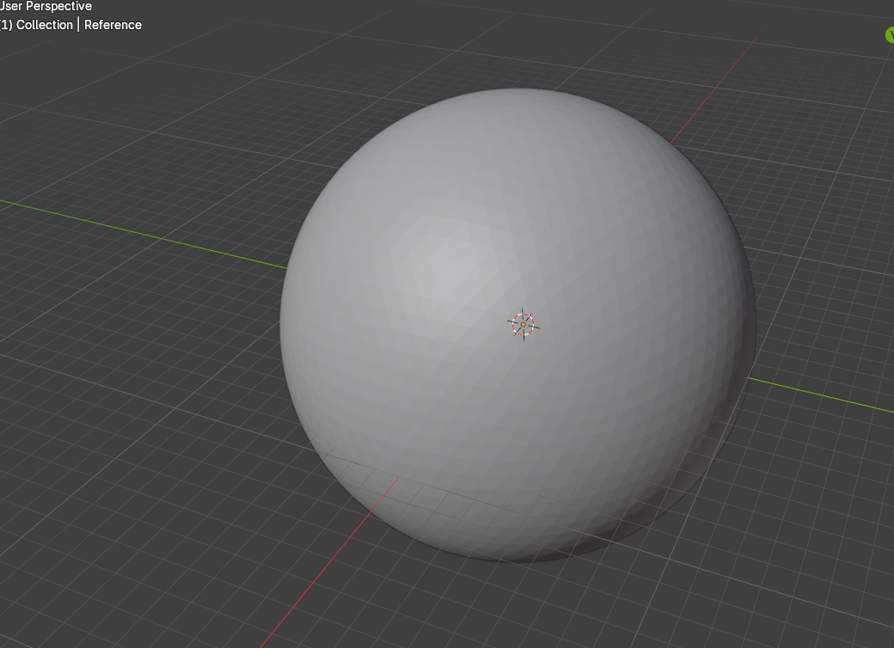
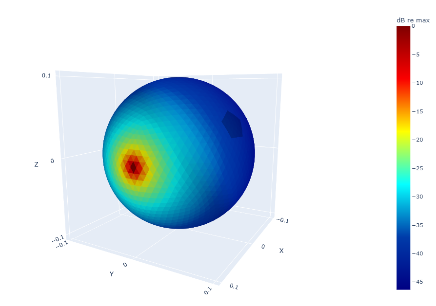

# KEMAR + VR headset — BEM transfer functions with Mesh2HRTF

Numerical TFs for a 4-microphone array on a dummy + headset. Open BEM (Mesh2HRTF / NumCalc). Comparison with a reference FEM/BEM model. Beamforming examples use these TFs; the optimizer itself is not published.

## KEMAR + VR headset: the CAD file

High-resolution geometry of a KEMAR-style head integrated with a **generic** VR headset.  
Used as the domain for **open-source BEM** (Mesh2HRTF / NumCalc) to compute microphone transfer functions.

This repository documents **validation** and **far-field TFs** for a 4-microphone subset of the array.  
Beamforming examples (MVDR, near-field) can be built from these TFs; **the optimizer is not published**.

Company page: [bloo-audio.com/array51](https://www.bloo-audio.com/array51/)

## What this model is for

- Array design on a dummy + headset (diffraction, shadowing)
- Far-field TFs toward a 1 m sphere (and optional 10 m grid)
- Inputs for MVDR / LCMV / Ambisonics / SSL — you bring the weights

## What we computed here

- Reciprocal **point sources** at four headset microphone positions (right-side linear array, 2.5 cm spacing)
- Evaluation on a 1 m sphere (~1850 points)
- Check against a reference FEM/BEM model: magnitude within ~0.2 dB, phase matched after the \(e^{\pm j\omega t}\) convention (`-angle` on NumCalc)

## Contents

1. Sphere / piston and point-source **validation** (Ico mesh)
2. **Nahoom** TFs (KEMAR + generic VR)
3. Figures (look-direction TFs, example directivity balloons)

Mesh2HRTF: [mesh2hrtf.org](https://mesh2hrtf.org/)

## Part I — Validation of the Mesh2HRTF BEM solver

Rigid sphere, radius \(a = 0.1\,\mathrm{m}\). Ico-5 mesh: 5120 faces, mean edge \(\approx 7.5\,\mathrm{mm}\) (\(\approx\lambda/6\) at 8 kHz, \(c = 346.18\,\mathrm{m/s}\)).  
Evaluation at \(r = 10\,\mathrm{m}\) (and 1.5 m for near-field checks).

### Point-source standoff

Wiki floor: source \(\geq 0.3\,\mathrm{mm}\) outside the skin.  
Kreuzer: about one mean edge. We scanned **5 / 2 / 1 mm** on \(+x\).

standoff | x (m) | high frequency | low frequency
--- | --- | --- | ---
5 mm | 0.105 | drop above 5 kHz (0 and 30 deg) | good
2 mm | 0.102 | best, near 6 dB baffle step | good
1 mm | 0.101 | crushed above 3 kHz, ~5.5 dB at 7–8 kHz | best LF collapse to 0 dB

**Working choice: 2 mm.** Same offset used later on the headset.

### Other checks

- Ico vs UV body mesh: elongated polar triangles on UV pollute 100 Hz and poles; Ico does not
- FMM cluster diameter 0.05 vs 0.025 m: **no change** on the look TF
- Piston vs point: piston needs the area factor \(S\); point uses \(P_0=1\) i.e. \(e^{ikR}/(4\pi R)\). At 1 m, \(20\log_{10}(4\pi)\approx +22\,\mathrm{dB}\) to reach 1 Pa

Figures: Ico balloon / \(|H(\phi)|\) at 0–150°, 100 Hz–8 kHz (notebook `SPHERE`).

## Solver

NumCalc solves the Helmholtz equation with a **Burton–Miller collocation BEM**.
Optionally the **multilevel fast multipole method (ML-FMM)** replaces
element-to-element coupling by cluster-to-cluster coupling.
We used ML-FMM (cluster diameter 0.05 m). Changing it to 0.025 m did not
change the look-direction TFs on this mesh.

References: Kreuzer et al. 2024; Brinkmann et al. JAES 2023.

Doc pratique  Wiki : https://github.com/Any2HRTF/Mesh2HRTF/wiki  
Site : https://mesh2hrtf.org/  
API Python : https://mesh2hrtf.readthedocs.io/

Théorie (à citer, pas à recopier)  BEM tête / maillage : Ziegelwanger, Majdak, Kreuzer, JASA 2015  
Pipeline Mesh2HRTF : Brinkmann et al., JAES 2023  
NumCalc (solver) : Kreuzer et al., Eng. Anal. Bound. Elem. 2024 — Burton–Miller + FMM

# Sphere validation — plane wave vs reciprocal point source

We compare two related but distinct problems that should agree closely
on the rigid-sphere boundary and, by reciprocity, at far-field points
at \(r = 10\,\mathrm{m}\):

- analytical scattering of a plane wave (Morse);
- a point source placed a few millimetres outside the skin (Mesh2HRTF / NumCalc),
  used as a reciprocal stand-in for a surface microphone.

\(|p|\) is reported on the boundary at \(0^\circ, 30^\circ, 60^\circ, 90^\circ, 120^\circ, 150^\circ, 180^\circ\).
Overall the match is excellent from \(100\,\mathrm{Hz}\) to \(8\,\mathrm{kHz}\)

###  BEM model

The rigid sphere and its Ico mesh were built in Blender, then exported with the Mesh2HRTF preprocessor (`mesh2input`) to generate the NumCalc input (`NC.inp` and surface meshes).

The rigid-sphere mesh is an icosahedral triangulation with **4 subdivisions**
(**5120 triangular elements**, **2562 nodes**). The mean edge length is
**$h \approx 7.53\,\mathrm{mm}$** (about $7.5\,\mathrm{mm}$).

With $c = 346.18\,\mathrm{m/s}$, the usual rule of six elements per wavelength
($\lambda/6$) holds up to

$$
f_{\lambda/6} = \frac{c}{6h} \approx 7.7\,\mathrm{kHz}.
$$

|
   
  |
   
 |
|                              ---                                               |  -----   |
| 
 <i> BEM model - Rigid Sphere   radius a=0.1m (Blender) </i> 
   |    
 <i> mshr2HSRTF: Pressure field 1kHz - point source at x=0.102 m </i>        
              |

At $8\,\mathrm{kHz}$ the mesh is slightly coarser than $\lambda/6$
($\approx\lambda/5.75$). Burton–Miller collocation BEM often needs **more than
six elements per wavelength** at high $ka$, so part of the residual mismatch
above $ka \approx 10$ ($\approx 5.5\,\mathrm{kHz}$) — in particular the
$0.2\,\mathrm{dB}$ drop at $0^\circ$ and $30^\circ$ toward $6$–$8\,\mathrm{kHz}$ —
is consistent with discretisation / quadrature rather than a geometry error.
A five-subdivision Ico mesh ($20\,480$ faces, $h \approx 3.8\,\mathrm{mm}$)
would put $\lambda/6$ well above $8\,\mathrm{kHz}$ if a tighter high-frequency
check is required.

### Residual discrepancies

**Low frequency** (\(50\)–\(100\,\mathrm{Hz}\), \(ka \approx 0.1\)–\(0.2\)).  
The analytical field is essentially isotropic (\(\sim 0\,\mathrm{dB}\) spread across angles).
Mesh2HRTF shows a slightly larger angular variance, about \(0.3\)–\(0.4\,\mathrm{dB}\).

**High frequency** (around \(ka = 10\)).  
On the illuminated side (\(0^\circ\) and \(30^\circ\)) the computed amplitude sags by about \(0.2\,\mathrm{dB}\).
The same droop appears in other Mesh2HRTF validations. Likely causes are the
Burton–Miller discretisation, FMM clustering, and/or the quadrature — not the
geometry itself.

**Parameters that do *not* move the look-direction TF.**  
FMM cluster diameter \(0.05\,\mathrm{m}\) vs \(0.025\,\mathrm{m}\) has no significant effect
on this Ico-5 mesh.

**Parameter that *does* matter.**  
Point-source standoff from the skin. After a \(5 / 2 / 1\,\mathrm{mm}\) scan on \(+x\),
**\(2\,\mathrm{mm}\)** is the working choice (clean high-frequency baffle step,
acceptable low-frequency collapse). The same offset is used later for headset
microphone positions.

### Practical conclusion

Treat Mesh2HRTF as a solid open BEM tool for research and array design —
MVDR / LCMV, binaural beamforming, and SSL — in the **\(100\)–\(8000\,\mathrm{Hz}\)**
band that matters for AR/VR devices. Use a \(\sim 2\,\mathrm{mm}\) reciprocal
point source for surface microphones, keep an eye on the low-frequency angular
spread and the mild high-frequency look-direction loss, and add a targeted
check when a new mesh or frequency grid is introduced.

Do not publish third-party trial FEM/BEM field plots. A magnitude agreement
of about \(0.2\,\mathrm{dB}\) (phase aligned after the \(e^{\pm j\omega t}\) convention)
is sufficient to state in the text.

