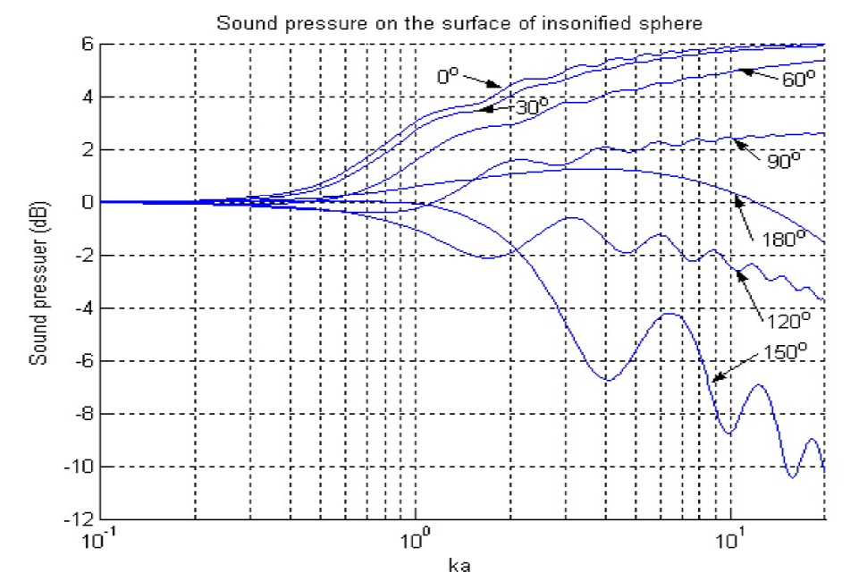
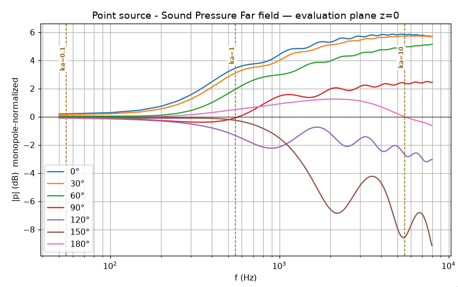
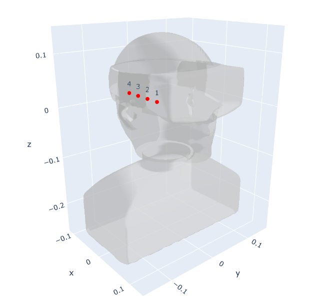
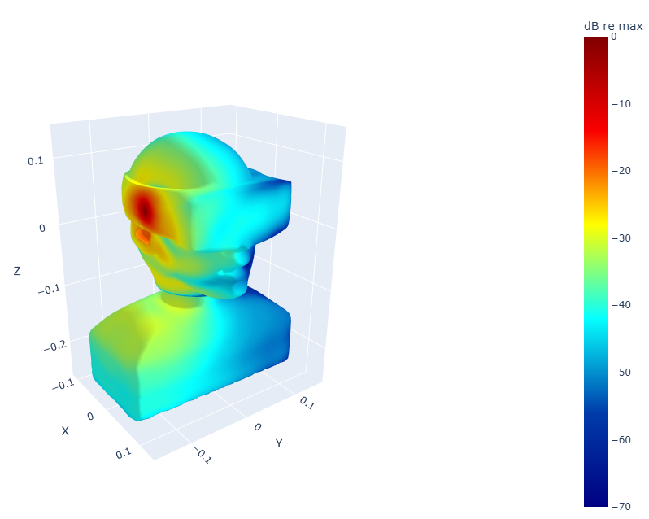

# KEMAR + VR headset — beamforming with Mesh2HRTF

Numerical TFs for a 4-microphone array on a dummy + headset. Open BEM (Mesh2HRTF / NumCalc). Comparison with a reference FEM/BEM model. Beamforming examples use these TFs; the optimizer itself is not published.

# KEMAR + VR headset — beamforming with Mesh2HRTF

## Introduction 

Open BEM (Mesh2HRTF / NumCalc) is used to compute microphone transfer
functions on rigid bodies, then to build a small MVDR beamformer.

The point is practical: can a *free* Burton–Miller + FMM solver replace
a closed BEM code for array design on a dummy and a headset, in the
$100\,\mathrm{Hz}$–$8\,\mathrm{kHz}$ band that matters for AR / VR?

We do not publish the optimiser. We publish the meshes, the TFs, and
example MVDR patterns (white-noise gain floored at $-25\,\mathrm{dB}$
below $500\,\mathrm{Hz}$, ramping to $-30\,\mathrm{dB}$ above $1\,\mathrm{kHz}$).

**Part I — Validation on a rigid sphere** ($a=0.10\,\mathrm{m}$).
An Ico-4 mesh is compared with the Morse plane-wave solution, using a
reciprocal point source $2\,\mathrm{mm}$ off the skin and observers at
$10\,\mathrm{m}$. That run fixes the units, the standoff, and the
trust we can put in NumCalc.

**Part II — KEMAR + VR headset, 4-microphone MVDR.**
A KEMAR-style dummy is merged with a simplified generic headset. Four
point sources on a linear $2.5\,\mathrm{cm}$ line feed far-field TFs
toward $\mathbf{r}=(1,0,0)\,\mathrm{m}$ (fixed look). Boundary $|p|$,
a planar cut of the beampattern, and DI / WNG vs frequency are the
public figures.

Company page: [bloo-audio.com/array51](https://www.bloo-audio.com/array51)

## Acknowledgements

This work uses **Mesh2HRTF / NumCalc**
(https://github.com/Any2HRTF/Mesh2HRTF).

Development started at the Acoustics Research Institute (ÖAW, Vienna)
with Harald Ziegelwanger, Wolfgang Kreuzer and Piotr Majdak, and
continues with Fabian Brinkmann (TU Berlin) and Katharina Pollack (ARI).

Please cite:

- Ziegelwanger, Majdak, Kreuzer, *J. Acoust. Soc. Am.* 2015
- Brinkmann et al., *J. Audio Eng. Soc.* 2023
- Kreuzer et al., *Eng. Anal. Bound. Elem.* 2024

## Part I — Validation of the Mesh2HRTF BEM solver

Rigid sphere, radius \(a = 0.1\,\mathrm{m}\). Ico-5 mesh: 5120 faces, mean edge \(\approx 7.5\,\mathrm{mm}\) (\(\approx\lambda/6\) at 8 kHz, \(c = 346.18\,\mathrm{m/s}\)).  
Evaluation at \(r = 10\,\mathrm{m}\) (and 1.5 m for near-field checks).

### Point-source standoff

Wiki floor: source \(\geq 0.3\,\mathrm{mm}\) outside the skin.  
Kreuzer: about one mean edge. We scanned **5 / 2 / 1 mm** on \(+x\).

standoff | x (m) | high frequency | low frequency
--- | --- | --- | ---
5 mm | 0.105 | drop above 5 kHz (0 and 30 deg) | good
2 mm | 0.102 | best, near 6 dB baffle step | good
1 mm | 0.101 | crushed above 3 kHz, ~5.5 dB at 7–8 kHz | best LF collapse to 0 dB

**Working choice: 2 mm.** Same offset used later on the headset.

### Other checks

- Ico vs UV body mesh: elongated polar triangles on UV pollute 100 Hz and poles; Ico does not
- FMM cluster diameter 0.05 vs 0.025 m: **no change** on the look TF
- Piston vs point: piston needs the area factor \(S\); point uses \(P_0=1\) i.e. \(e^{ikR}/(4\pi R)\). At 1 m, \(20\log_{10}(4\pi)\approx +22\,\mathrm{dB}\) to reach 1 Pa

Figures: Ico balloon / \(|H(\phi)|\) at 0–150°, 100 Hz–8 kHz (notebook `SPHERE`).

## Solver

NumCalc solves the Helmholtz equation with a **Burton–Miller collocation BEM**.
Optionally the **multilevel fast multipole method (ML-FMM)** replaces
element-to-element coupling by cluster-to-cluster coupling.
We used ML-FMM (cluster diameter 0.05 m). Changing it to 0.025 m did not
change the look-direction TFs on this mesh.

References: Kreuzer et al. 2024; Brinkmann et al. JAES 2023.

Doc pratique  Wiki : https://github.com/Any2HRTF/Mesh2HRTF/wiki  
Site : https://mesh2hrtf.org/  
API Python : https://mesh2hrtf.readthedocs.io/

Théorie (à citer, pas à recopier)  BEM tête / maillage : Ziegelwanger, Majdak, Kreuzer, JASA 2015  
Pipeline Mesh2HRTF : Brinkmann et al., JAES 2023  
NumCalc (solver) : Kreuzer et al., Eng. Anal. Bound. Elem. 2024 — Burton–Miller + FMM
Morse and Ingrad (1968)

# Sphere validation — plane wave vs reciprocal point source

We compare two related but distinct problems that should agree closely
on the rigid-sphere boundary and, by reciprocity, at far-field points
at \(r = 10\,\mathrm{m}\):

- analytical scattering of a plane wave (Morse);
- a point source placed a few millimetres outside the skin (Mesh2HRTF / NumCalc),
  used as a reciprocal stand-in for a surface microphone.

\(|p|\) is reported on the boundary at \(0^\circ, 30^\circ, 60^\circ, 90^\circ, 120^\circ, 150^\circ, 180^\circ\).
Overall the match is excellent from \(100\,\mathrm{Hz}\) to \(8\,\mathrm{kHz}\)

###  BEM model

The rigid sphere and its Ico mesh were built in Blender, then exported with the Mesh2HRTF preprocessor (`mesh2input`) to generate the NumCalc input (`NC.inp` and surface meshes).

The rigid-sphere mesh is an icosahedral triangulation with **4 subdivisions**
(**5120 triangular elements**, **2562 nodes**). The mean edge length is
**$h \approx 7.53\,\mathrm{mm}$** (about $7.5\,\mathrm{mm}$).

With $c = 346.18\,\mathrm{m/s}$, the usual rule of six elements per wavelength
($\lambda/6$) holds up to

$$
f_{\lambda/6} = \frac{c}{6h} \approx 7.7\,\mathrm{kHz}.
$$

|
   
  |
   
 |
|                              ---                                               |  -----   |
| 
 <i> BEM model - Rigid Sphere   radius a=0.1m   5120 triangular elements, 2562 nodes (Blender) </i> 
   |    
 <i> mshr2HSRTF: Pressure field on boundary 1kHz   point source at (x,y,z)=(0.102,0,0) m </i>        
              |

At $8\,\mathrm{kHz}$ the mesh is slightly coarser than $\lambda/6$
($\approx\lambda/5.75$). Burton–Miller collocation BEM often needs **more than
six elements per wavelength** at high $ka$, so part of the residual mismatch
above $ka \approx 10$ ($\approx 5.5\,\mathrm{kHz}$) — in particular the
$0.2\,\mathrm{dB}$ drop at $0^\circ$ and $30^\circ$ toward $6$–$8\,\mathrm{kHz}$ —
is consistent with discretisation / quadrature rather than a geometry error.
A five-subdivision Ico mesh ($20\,480$ faces, $h \approx 3.8\,\mathrm{mm}$)
would put $\lambda/6$ well above $8\,\mathrm{kHz}$ if a tighter high-frequency
check is required.

### Results and residual discrepancies

We compare two fields that reciprocity says should agree closely:

- the analytical rigid-sphere scattering of a plane wave (Morse []);
- a Mesh2HRTF / NumCalc BEM run with a point source $2\,\mathrm{mm}$ outside the skin, pressure sampled at $r = 10\,\mathrm{m}$ from $0^\circ$ to $180^\circ$ in a meridional plane.

The two problems are not identical, but the far-field patterns should match. They do, to a fraction of a decibel over most of the $100\,\mathrm{Hz}$–$8\,\mathrm{kHz}$ band.

|
   
  |
   
 |
|                              ---                                               |  -----   |
| 
 <i> Analytical Model - Sound pressure on the sphere   Plane  z=0  - Various angles </i> 
   |    
 <i> mshr2HSRTF BEM Model - Sound pressure at 10 m    Plane  z=0  - Various angles </i>        
              |

At $ka \approx 0.1$ the Mesh2HRTF far-field samples at $r = 10\,\mathrm{m}$ are:

| Angle | $\|p\|$ | Level re $0^\circ$ |
|---|---|---|
| $0^\circ$ | $1.0212\times 10^{-1}$ | $0.00\,\mathrm{dB}$ |
| $30^\circ$ | $1.0161\times 10^{-1}$ | $-0.04\,\mathrm{dB}$ |
| $60^\circ$ | $1.0044\times 10^{-1}$ | $-0.14\,\mathrm{dB}$ |
| $90^\circ$ | $9.9313\times 10^{-2}$ | $-0.24\,\mathrm{dB}$ |
| $120^\circ$ | $9.8742\times 10^{-2}$ | $-0.29\,\mathrm{dB}$ |
| $150^\circ$ | $9.8670\times 10^{-2}$ | $-0.30\,\mathrm{dB}$ |

The angular spread is **$0.30\,\mathrm{dB}$**. The analytical plane-wave solution (and the reference BEM) is essentially isotropic at this $ka$. The bias is therefore numerical: Burton–Miller collocation and FMM / quadrature at low frequency, not the $2\,\mathrm{mm}$ standoff and not the $10\,\mathrm{m}$ station.

**Low frequency** (\(50\)–\(100\,\mathrm{Hz}\), \(ka \approx 0.1\)–\(0.2\)).  
The analytical field is essentially isotropic (\(\sim 0\,\mathrm{dB}\) spread across angles).
Mesh2HRTF shows a slightly larger angular variance, about \(0.3\)–\(0.4\,\mathrm{dB}\).

**High frequency** (around \(ka = 10\)).  
On the illuminated side (\(0^\circ\) and \(30^\circ\)) the computed amplitude sags by about \(0.2\,\mathrm{dB}\).
The same droop appears in other Mesh2HRTF validations. Likely causes are the
Burton–Miller discretisation, FMM clustering, and/or the quadrature — not the
geometry itself.

**Parameters that do *not* move the look-direction TF.**  
FMM cluster diameter \(0.05\,\mathrm{m}\) vs \(0.025\,\mathrm{m}\) has no significant effect
on this Ico-5 mesh.

**Parameter that *does* matter.**  
Point-source standoff from the skin. After a \(5 / 2 / 1\,\mathrm{mm}\) scan on \(+x\),
**\(2\,\mathrm{mm}\)** is the working choice (clean high-frequency baffle step,
acceptable low-frequency collapse). The same offset is used later for headset
microphone positions.

### Practical conclusion

Treat Mesh2HRTF as a solid open BEM tool for research and array design —
MVDR / LCMV, binaural beamforming, and SSL — in the **\(100\)–\(8000\,\mathrm{Hz}\)**
band that matters for AR/VR devices. Use a \(\sim 2\,\mathrm{mm}\) reciprocal
point source for surface microphones, keep an eye on the low-frequency angular
spread and the mild high-frequency look-direction loss, and add a targeted
check when a new mesh or frequency grid is introduced.

More mature commercial BEM codes pass the $ka \approx 0.1$ test to a few hundredths of a dB. Mesh2HRTF does not: the $0.3\,\mathrm{dB}$ front-to-back tilt is a low-frequency discretisation / quadrature error.

That matters for **low-frequency array design**. In a superdirective beamformer (MVDR, LCMV) a few tenths of a dB of false magnitude — and the associated phase — change the white-noise gain and the realised directivity. Treat Mesh2HRTF TFs below a few hundred hertz with extra regularisation, or cross-check that band with another solver, before freezing weights.

Do not publish third-party trial FEM/BEM field plots. A magnitude agreement
of about \(0.2\,\mathrm{dB}\) (phase aligned after the \(e^{\pm j\omega t}\) convention)
is sufficient to state in the text.

## Part II: Microphone array I — far field, fixed look $(1,0,0)$

## KEMAR + VR headset: the CAD file

High-resolution geometry of a KEMAR-style head integrated with a **generic** VR headset.  
Used as the domain for **open-source BEM** (Mesh2HRTF / NumCalc) to compute microphone transfer functions.

## Geometry

This is an in-house concept mesh for open BEM (Mesh2HRTF / NumCalc).
It is **not** a vendor product and is **not** affiliated with any commercial
VR headset.

### Head and torso

KEMAR-style dummy CAD developed at **ICAR**
(*Infrastructure commune en acoustique pour la recherche*,
ÉTS–IRSST, École de technologie supérieure, Montréal).

### Headset

A high-quality generic VR-headset CAD by **Chris Leung** on GrabCAD:
https://grabcad.com/chris.leung-5/models

The headset was simplified and edited: the headband was reduced to about
$5$–$6\,\mathrm{cm}$ width. The edited headset was then merged with the
KEMAR-style dummy into a single watertight skin.

The working file distributed here is an **STL** surface mesh (plus the
Mesh2HRTF `ObjectMeshes` export).

## Coordinates and units

Units are **metres**.

- Origin: midway between the two ear-canal / pinna references.
- $+x$: look-ahead (nose / headset front).
- $+y$: left–right axis through the two ears (sign: state whether $+y$ is
  **left** or **right** when you check in Blender).
- $+z$: up.

The published STL is rebuilt from Mesh2HRTF `Nodes.txt` / `Elements.txt`
with a neutral header (not a vendor export).

The skin is **not** a topological sphere. A gap between the headset strap
and the head, just forward of each pinna, makes two handles
(homeomorphic to a sphere with two handles, genus 2). BEM treats the
surface as a rigid sound-hard boundary; the strap–head tunnels are part
of the exterior domain. 

### What the mesh is for

- beamforming (MVDR / LCMV)
- sound-source localisation
- binaural beamforming
- Ambisonics / array processing on a dummy + headset

Microphone examples in this repo use a small linear subset on one side of
the headset (2.5 cm spacing). Reciprocal point sources sit $2\,\mathrm{mm}$
off the skin.

This repository documents **validation** and **far-field TFs** for a 4-microphone subset of the array.  
Beamforming examples (MVDR, near-field) can be built from these TFs; **the optimizer is not published**.

Company page: [bloo-audio.com/array51](https://www.bloo-audio.com/array51/)

## What this model is for

- Array design on a dummy + headset (diffraction, shadowing)
- Far-field TFs toward a 1 m sphere (and optional 10 m grid)
- Inputs for MVDR / LCMV / Ambisonics / SSL — you bring the weights

## What we computed here

- Reciprocal **point sources** at four headset microphone positions (right-side linear array, 2.5 cm spacing)
- Evaluation on a 1 m sphere (~1850 points)
- Check against a reference FEM/BEM model: magnitude within ~0.2 dB, phase matched after the \(e^{\pm j\omega t}\) convention (`-angle` on NumCalc)

## Contents

1. Sphere / piston and point-source **validation** (Ico mesh)
2. **Nahoom** TFs (KEMAR + generic VR)
3. Figures (look-direction TFs, example directivity balloons)

Mesh2HRTF: [mesh2hrtf.org](https://mesh2hrtf.org/)

KEMAR-style dummy + generic VR headset (see Geometry). Four reciprocal
**point sources** sit $2\,\mathrm{mm}$ off the skin at the microphone
seats, $2.5\,\mathrm{cm}$ apart on a **linear** end-fire line along the
headset. By reciprocity, each BEM run is a transfer function from that
seat to the field — or from a field point back to the seat.

The design look is the far-field / $1\,\mathrm{m}$ station
$\mathbf{r}_{\mathrm{look}}=(1,0,0)\,\mathrm{m}$ (nose / $+x$).
Because the array is linear and aligned with the look, the beam is a
**fixed frontal** beam: one steering vector $\mathbf{d}(f)$ toward
$(1,0,0)$, no electronic scan in this example. Side and back directions
are evaluated on the $1\,\mathrm{m}$ sphere only to plot the pattern.

TFs: $H_m(f;\mathbf{r})$ at microphones $m=1,2,3,4$. MVDR weights use
these TFs with a white-noise-gain floor ($-25\,\mathrm{dB}$ below
$500\,\mathrm{Hz}$, ramping to $-30\,\mathrm{dB}$ above $1\,\mathrm{kHz}$).

Boundary $|p|$ for one $2\,\mathrm{mm}$ point source (vertex-interpolated
display). The optimiser is not published; the TFs are.

### Reproducing the BEM run

The Mesh2HRTF project (`NC.inp`, surface mesh, evaluation grid) is in
`bem/`. NumCalc solves a Burton–Miller system at each frequency.

The Helmholtz kernel depends on $k=\omega/c$, so the self-influence
matrix **must** be rebuilt at every frequency. There is no free lunch
across the band.

What *can* be reused, and is not yet wired in our scripts: at a **fixed**
frequency the left-hand side is the same for every microphone seat.
Only the right-hand side changes (reciprocal point source $2\,\mathrm{mm}$
off each seat). Today each source folder (`source_1` … `source_4`)
reassembles $A(k)$ from scratch. A single factorisation of $A(k)$ and
four RHS solves would cut the four-mic campaign by about $4\times$ per
frequency. We have not found a clean NumCalc switch for that yet.

Geometry, $c=346.18\,\mathrm{m/s}$, FMM cluster diameter $0.05\,\mathrm{m}$,
and the $2\,\mathrm{mm}$ standoff are documented in `NC.inp`.

## References

Théorie (à citer, pas à recopier)  BEM tête / maillage : Ziegelwanger, Majdak, Kreuzer, JASA 2015  
Pipeline Mesh2HRTF : Brinkmann et al., JAES 2023  
NumCalc (solver) : Kreuzer et al., Eng. Anal. Bound. Elem. 2024 — Burton–Miller + FMM
Morse and Ingard, "Theoretical Acoustics" (1968)

[4] P. M. Morse and K. U. Ingard, *Theoretical Acoustics*,
Princeton University Press, Princeton, NJ, 1986
(reprint of the 1968 McGraw-Hill edition).
ISBN 0-691-02401-4.

